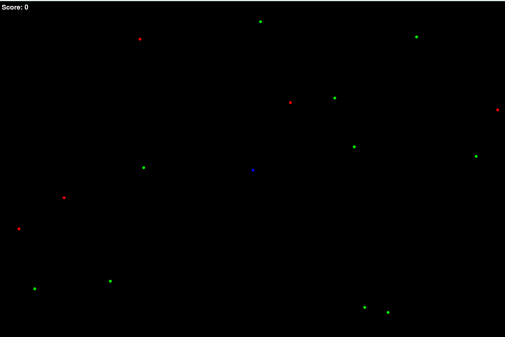

## predator-prey simulator

### how to play
- press space to start
- use w-a-s-d buttons to move (player=blue)
- escape from red (predator)
- eat green yummy (prey)

### currently: player tries to escape from red enemies and eats green enemies.

enemies have 4 different states: rest, walk, run, lifeordeath

these states consume different energy levels and produce different move speeds.

### in future: population evolution/distribution simulator for simple organisms

## todo: 

- [ ] implement AI and remove player.
- [ ] add visuals instead of simple shapes.
- [ ] ...

stable versions:
- python gamev2.py
- python gamev3.py

beta version:
- python main.py